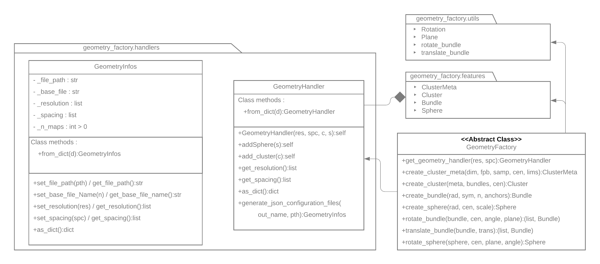
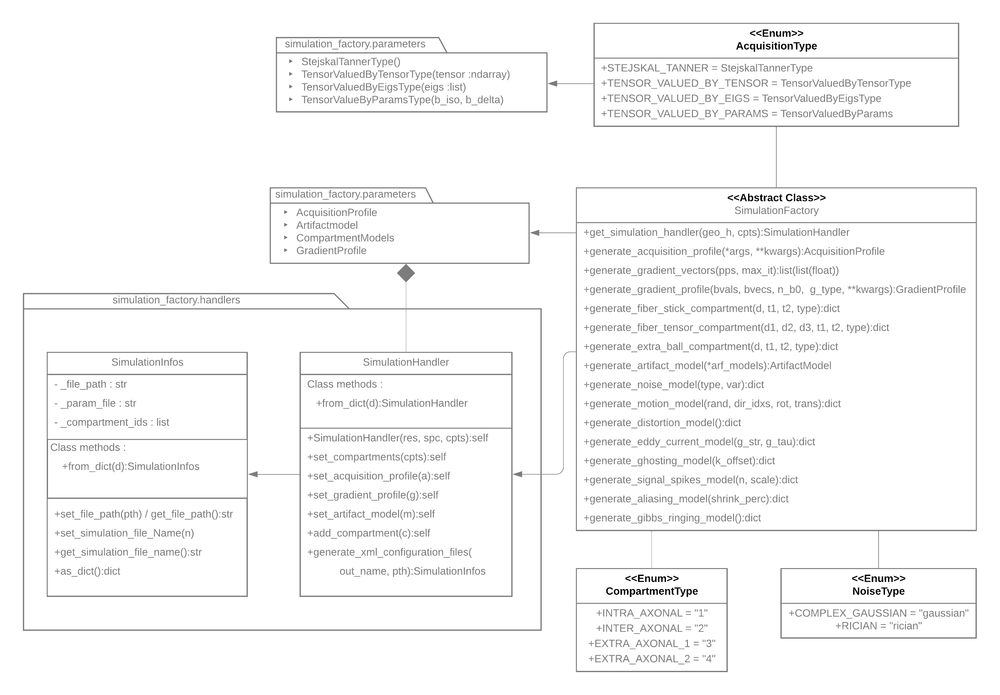

API
===

In this section, we'll go through the whole python API designed to interface with the
**C++** code. The library is divided into two portions, one that handles the creation
of the configuration files, the other running the simulator on those configurations.

Configuration
-------------

Configuration files must be created for both the geometry generation application and
the simulation application. Two python classes, acting as method factories, are used
to do so.

GeometryFactory
_______________

The :py:class:`~simulator.factory.geometry_factory.geometry_factory.GeometryFactory`
handles everything that has to do with the spatial configuration of the simulation. It
is used to parametrize correctly geometry primitives, which are then used to create
images and fiber models via the geometry generation application.

Here is a subset of the functionality offered by the factory. A complete list of them
is available at :py:class:`~simulator.factory.geometry_factory.geometry_factory.GeometryFactory`.

- Definition of a Bundle :

  This is done via the method :py:meth:`~simulator.factory.geometry_factory.geometry_factory.GeometryFactory.create_bundle`.
  A bundle is defined by its radius, its radial symmetry, the anchors of its centroid
  and the number of points used to estimate the spline representing the centroid (See
  :doc:`concepts` for more information on the spline representation).

- Definition of the cluster space :

  This is done via the method :py:meth:`~simulator.factory.geometry_factory.geometry_factory.GeometryFactory.create_cluster_meta`.
  It takes as parameters :

  - the number of dimensions of the world (most of the time 3)
  - the number of fibers for each bundle inside the cluster
  - the sampling distance between each fiber's points
  - the cluster's center in the world
  - the limits of the cluster's space

- Definition of a cluster :

  This is done via the method :py:meth:`~simulator.factory.geometry_factory.geometry_factory.GeometryFactory.create_cluster`.
  The method takes a :py:class:`~simulator.factory.geometry_factory.features.cluster_meta.ClusterMeta`
  definition (acquired at previous step) and a list of bundles. A center in the world can
  be provided, if not the barycenter of the cluster will be placed at the center of the
  resulting image.

The factory also provides methods to create other primitives and to operate some
affine transformation on them. See
:py:class:`~simulator.factory.geometry_factory.geometry_factory.GeometryFactory`
for more on the subject.

The objects created by the factory can be found in :py:mod:`simulator.factory.geometry_factory.features`.
It is however recommended to use the factory to spawn them in order to ensure their
initialization to be complete.

SimulationFactory
_________________

The :py:class:`~simulator.factory.simulation_factory.simulation_factory.SimulationFactory`
manages all the components describing the acquisition and the models that link the
primitives of the geometry factory to the output diffusion images. To do so, the block
that makes the simulation configuration file have been partitioned into different
sub-categories, whose associated objects can be found in :py:mod:`simulator.factory.simulation_factory.parameters`.

The classes describing them and the associated methods in the factory are given here.

- Acquisition profile

  The :py:class:`~simulator.factory.simulation_factory.parameters.acquisition_profile.AcquisitionProfile`
  object contains the parameters related to the *mri* machine itself. Since vendors can
  supply their machines with equipments and software leading to drastically different
  controls and contrasts, the simulator allows for a specification of parameters like :

  - Number of channels (coils) used for the acquisition
  - Scaling operated on the resulting signal
  - Time delay caused by inhomogeneities in the gradient field

  Those parameters are contained in the object, along with some sequence related
  parameters that are heavily bound to a specific vendor or default for a wide array of
  gradient schemes.

  - Echo time
  - Repetition time
  - Dwell time
  - Partial fourier coefficient (ratio of sub-sampling of the k-space)
  - reverse phase encoding

  A fixed axon radius for all clusters can also be supplied through this object. If not,
  the radius will be computed for each cluster at runtime.

  The object can be constructed calling
  :py:meth:`~simulator.factory.simulation_factory.simulation_factory.SimulationFactory.generate_acquisition_profile`.

- Gradient profile

  A :py:class:`~simulator.factory.simulation_factory.parameters.gradient_profile.GradientProfile`
  encapsulates the b-values and b-vectors of a sequence. It also specifies which type of
  sequence is to be run, along with their specific parameters. To construct the object,
  one requires :

  - A set of gradient vectors, which if not available can be computed with the help of
    :py:meth:`~simulator.factory.simulation_factory.simulation_factory.SimulationFactory.generate_gradient_vectors`.
    It uses Caruyer q-space
    sampling tool [QSS1_P]_ [QSS2_P]_ to spread out evenly the gradient vectors across
    the different shells.
  - A set of b-values, one per vector in the previous list
  - An acquisition type. By default falls back to a typical :py:class:`~simulator.factory.simulation_factory.parameters.gradient_profile.StejskalTannerType`
    acquisition.

    Can be switched to a Tensor-Valued acquisition, in which case an other set of
    parameters must be supplied to initialize the AcquisitionType object.

    - Tensor-Valued by eigenvalues :

      Initializes the object for a Tensor-valued acquisition using the 3 given
      eigenvalues to build the acquisition tensor. :py:class:`~simulator.factory.simulation_factory.parameters.gradient_profile.TensorValuedByEigsType`

    - Tensor-Valued by Tensor :

      Initializes the object using a whole 3 by 3 2D tensor. :py:class:`~simulator.factory.simulation_factory.parameters.gradient_profile.TensorValuedByTensorType`

    - Tensor-Valued by parameters :

      Initializes the tensor using a b-iso and b-delta value to define the shape of
      the tensor. See :ref:`concepts_tensor_valued_anchor` for more information on
      this kind of initialization. :py:class:`~simulator.factory.simulation_factory.parameters.gradient_profile.TensorValuedByParamsType`

     Notice that, for a Tensor-Valued acquisition, the tensor is aligned along its
     last axis, so the biggest eigenvalue should be in last position in the arguments
     supplied.

  The object can be constructed calling
  :py:meth:`~simulator.factory.simulation_factory.simulation_factory.SimulationFactory.generate_gradient_profile`.
  The acquisition type can be supplied here and the parameters of its related object's
  constructor must be passed here. They are caught as the extra positional (*\*args*) and
  named parameters (*\*\*kwargs*) of the method.

- Compartment models

  The simulator is model-based, meaning that for a tissue to be simulated, a model for
  it must be supplied. Our application works by assigning a compartment to each primitive,
  which contains its physical characteristics required for signal generation.

  As of now, 3 different compartments can be parametrized :

  - Intra-axonal compartment

    Corresponds to the innermost part of the axon (our fibrous tissue). Can be modelized
    by :

    - a stick (single diffusivity, null radial diffusivity)
    - a Tensor (1 x diff. par., 2 x diff. perp.)

  - Inter-axonal compartment

    Corresponds to the outer rim around the axon (the skin around the tissue). can be
    parametrized using the same models as for intra-axonal

  - Extra-axonal comparment

    Corresponds to other compartments than the main fibrous tissue. Only one model is
    available for those, since they are destined to model heterogeneous tissues. It
    is the ball model, which takes a single diffusivity.

  in addition of the diffusivity, those model also contain the relaxation values T1 and
  T2.

  Any combination can be given to the simulator, but only one copy of each is to be
  taken into account, except for the extra-axonal one which can be given two times.

  This means that all the fibers intra and inter axonal medium will be describe by the
  same model. Also, know that if the second extra-axonal model is used for some
  primitive, no signal will be affected to the background of the image. Else, it will
  be used to parametrize it.

  The different models can be constructed via a few methods in the
  :py:class:`~simulator.factory.simulation_factory.simulation_factory.SimulationFactory`
  object here :

  - :py:meth:`~simulator.factory.simulation_factory.simulation_factory.SimulationFactory.generate_fiber_stick_compartment`
  - :py:meth:`~simulator.factory.simulation_factory.simulation_factory.SimulationFactory.generate_fiber_tensor_compartment`
  - :py:meth:`~simulator.factory.simulation_factory.simulation_factory.SimulationFactory.generate_extra_ball_compartment`

  The objects generated by those methods must then be put into a ::py:class:`~simulator.factory.simulation_factory.parameters.compartments_model.CompartmentModels`
  object, either directly or through the factory with

- Artifacts and Noise

  No realistic simulation would be one without the addition of the effects of bug and
  glitches that happen in real life. For this, an extensive catalog of noises and
  artifacts is available through the simulation factory. We refer the reader to the
  methods in the :py:class:`~simulator.factory.simulation_factory.simulation_factory.SimulationFactory`
  object for information on those, as well as to the web, which contains the
  documentation and theory required to comprehend each and every of those effects.

References
__________

.. [QSS1_P] Caruyer, E., Lenglet C., Sapiro G., Deriche R. (2013)
   Design of multishell sampling schemes with uniform coverage in diffusion MRI.
   Mag. Reson. Med., 69: 1534-1540. doi:10.1002/mrm.24736

.. [QSS2_P] Caruyer, E. Deriche, R. (2012)
   Diffusion MRI signal reconstruction with continuity constraint and optimal
   regularization. MIA, 16: 1113-1120. doi:10.1016/j.media.2012.06.011
