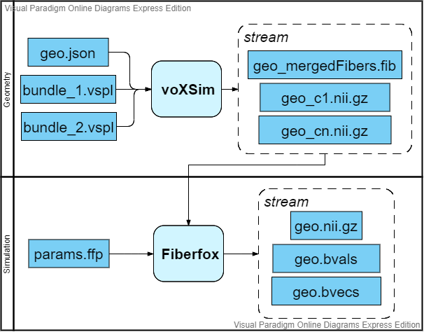
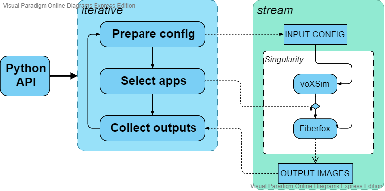

Architecture
============

**voXSim** is a tool developed to leverage the power of **MITK Fiberfox** simulation
generator as well as **ITK** and **VTK** powerful and extensible rendering and
processing tools, whilst maintaining a high level interface for ease of use from a
non-expert or general computer scientist.

As such, the project contains a series of sub-projects focused at realising either :

- Simulation generation

    Simulation is realized by MITK Fiberfox [FIB_UM]_ [FIB_P]_

- Geometry generation

    Geometry generation is done via **voXSim** *MITK* plugin

- High-level interfacing

    The python code contained in this project provides an high level API to both
    simulation and geometry generators

- Code portability and cross-platform

    All the generators code is packaged and available in a singularity

Simulation and Geometry
-----------------------

Geometry primitives and simulated images are created via the **MITK** code base in
**C++**, which ensures a low-level API for efficient processing.

To run a simulation, at least 3 configuration files are required :

- The first one, in the figure, *geo.json*, describes the geometry to be generated
   - the world space discretization
   - the affine relation of the primitives to the world
   - the definition of some basic primitives
   - etc.

- The *vspl* files define the clusters' (see :doc:`concepts`) primitives
  included in the *json*. Even if the extension of the file is different, the format
  inside it is pure **json**. Its content is divided into two objects :

  - **meta** contains information about the cluster's space (limits, center in world)
    and other global cluster parameters (density, sampling, ...)
  - **data** contains a list of objects describing the different bundles that form the
    cluster. Aside of the anchors defining the bundles' centroids are listed information
    like their radius, radial symmetry and sampling distance along their centroid.

- The *ffp* file contains all the informations required to modelize the voxel's
  population and to simulate the mri signal. Much can be said on that part, since
  the parameters range from machine specific (dwell time, gradient strength, partial
  fourier, ...) to acquisition specific (echo time, repetition time, gradients, ...)
  to noise artifacts, and more. A good explanation of the simulation process and the
  parameters can be found in [FIB_UM]_.

High-level Interfacing
----------------------

The parameter files described above are very descriptive and in small quantity could
be written by hand (believe me, I've done it). However, for complex simulations the
task can be quite trying.

To solve this, this project was created. It consists of a high-level python interface
built following the `Factory Pattern <FPTRN_URL_>`_. It translates the possible
configurations for both geometry and simulation into the required parameters files.

Aside from this, a runner class is provided to connect the flow of information from
the factories to the **C++** applications handling the actual processing.

For more information, the reader is refered to the :doc:`api` section of
this documentation.

Portability and Cross-Platform
------------------------------

The last goal this projects tackles is portability across platforms and operating
systems. Since the **API** was created to facilitate the usage of the simulator,
having it hard to install and configure would have made no sense.

With this in mind, an image containing most of the **C++** components of the project
was built using `Singularity <SIGN_URL_>`_. Doing so make the whole project available
to run on any machine with a singularity compatible operating system.

  We must inform the reader that for the time being, Singularity is still not natively
  available on Windows or Mac. However, it can be installed through the use of
  **Virtual Machines** and **Vagrant**. See the following `link <SIVA_URL_>`_ for
  installation directives.

References
__________

.. [FIB_UM] Mitk Fiberfox User Manual
   http://docs.mitk.org/2016.11/org_mitk_views_fiberfoxview.html

.. [FIB_P] Neher, P.F., Laun, F.B., Stieltjes, B. and Maier-Hein, K.H. (2014)
   Fiberfox: Facilitating the creation of realistic white matter software phantoms.
   Magn. Reson. Med., 72: 1460-1470. doi:10.1002/mrm.25045

.. _FPTRN_URL: https://sourcemaking.com/design_patterns/factory_method
.. _SIGN_URL: https://sylabs.io/docs/
.. _SIVA_URL: https://sylabs.io/guides/3.0/user-guide/installation.html