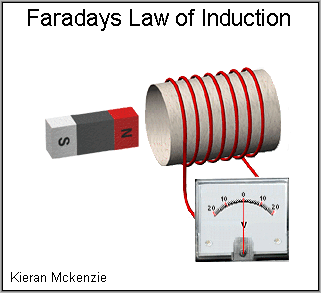
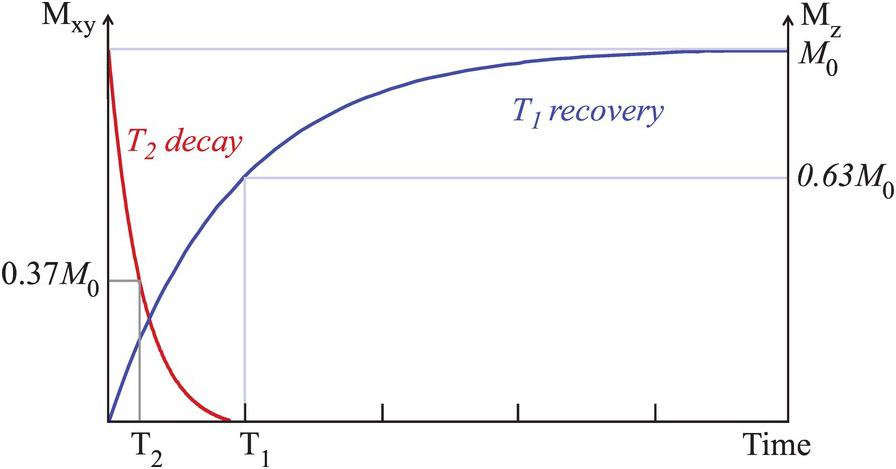

Concepts
========

Modeling the brain
------------------

There is multiple ways to define the medium in which the signal we want to emulate will
be simulated. For example, some techniques take directly a anatomical image (T1, B0) and
then simulate a diffusion signal on top of it. Others uses deeply complex and refined
mathematical models to relate water spins to diffusion mri signal, using some spatial
constraints.

The used here is a bit more simplistic, but allow us to define first geometrical primitives
representing tissues of the brain, and then simulate via a compartment model a mri signal.

Tissue primitives
_________________

As of now, two types of primitives are available in the simulator : spheres and bundles.

- Spheres :

  Spheres objects are defined through their respective **center** and **radius**
  attributes. Not much more to say on this ...

- Bundles :

  in comparison to spheres, a bundle definition is a bit more tricky. Conceptually, a bundle
  is only a simple *line* in space, represented by, for example, a spline, and a *radius*
  along the line. The simplest model we can propose is to define a bundle object as a set of :

  - A centroid :math:`l`, the line along which the bundle is defined
  - A set :math:`\mathbf{C}` of circles :math:`\mathcal{C}_r` of radius :math:`r`, one for
    each sample point on :math:`l`
  - A number of fibers composing the bundle :math:`N`

  .. image:: img/concepts/bundle_1.png
     :width: 600
     :align: center
     :alt: simple bundle with even radii circles on sample points

  To add more realism, since it is quite a reductive hypothesis to consider a fiber to retain
  it shape along its centroid, we'll allow for the radius along the centroid to vary. Doing so,
  we replace from the last definition the set :math:`\mathbf{C}` by :

  - A list :math:`\mathbf{R}` of radiuses along the centroid

  or

  - A function :math:`\Phi (\vec x)` associating a radius to a position :math:`\vec x`
    along the centroid

  and

  - A set :math:`\mathbf{C}` containing :math:`i` circles :math:`\mathcal{C}_{r_i}`, with
    radii :math:`r_i` either taken from :math:`\mathbf{R}` or :math:`\Phi (\vec x)`

  .. image:: img/concepts/bundle_2.png
     :width: 600
     :align: center
     :alt: Bundle with varying radii circles on sample points

  Another improvement can be made from last consideration. Notice that by varying the radius
  along the centroid, we only achieve part of the goal. The bundle shapes varies, however if
  a perpendicular slice is taken along the centroid, the resulting polygon will always be a
  perfect circle.

  Inspecting the literature on bundle's shape analysis, one can convince himself of this
  unrealistic representation. We'll thus allow for eccentricity of those circles along the
  centroid, effectively replacing the primitive with ellipsoids instead. This only adds a
  single parameter, the **symmetry** (or eccentricity) of the ellipsoid.

  .. image:: img/concepts/bundle_3.png
     :width: 600
     :align: center
     :alt: Bundle with varying radii and symmetry ellipsoids on sample points

  From previous definition, we once again need to modify the set :math:`\mathbf{C}` a bit,
  giving :

  - A list :math:`\mathbf{R}` of radiuses along the centroid
  - A list :math:`\mathbf{S}` of symmetries along the centroid

  or

  - A function :math:`\Phi (\vec x)` associating a radius and a symmetry to a position
    :math:`\vec x` along the centroid

  and

  - A set :math:`\mathbf{C}` containing :math:`i` circles :math:`\mathcal{C}_{r_i, s_i}`,
    with radii :math:`r_i` and symmetry :math:`s_i` either taken from :math:`\mathbf{R}`
    and :math:`\mathbf{S}` or from :math:`\Phi (\vec x)`.

Centroid
________

In this application, a bundle centroid is defined via spline. The chosen representation is
**Kochanek-Bartels spline** [KBS]_. In addition of the anchors defining the actual points the
spline goes through, this type of spline also allow for 3 other parameters controlling for
*tension*, *bias and *continuity*. Setting those at the trivial value of 0 gives a typical
**Catmull-Rom spline**.

- Tension

  The tension parameter controls for the length of the tangent vectors at each anchor. Thus,
  a positive value will decrease the effective "speed" at the anchor points of the spline,
  sharpening the bends occurring at them.

  .. image:: img/concepts/tension.gif
     :width: 400
     :align: center

- Bias

  The bias parameter changes the direction of the tangent vector at each anchor. Negative values
  will increase the weight of the forward derivative in the determination of the tangent at
  the anchor points, positive values the backward derivative.

  This allow to control of information from front to back and vice-versa in determining the
  splines points. A value of 0 translates to a centered derivative.

  .. image:: img/concepts/bias.gif
     :width: 400
     :align: center

- Continuity

  This parameter controls for the continuity at the anchors of the spline. Perfect continuity
  is only achieved at a value of 0. For other values, the tangents at those points deviate
  from each other incrementally.

  .. image:: img/concepts/continuity.gif
     :width: 400
     :align: center

Modeling MRI Signal
-------------------

There is many approach that can be taken to simulate the magnetization signal obtain from
the water molecules of the brain tissues. Model-free methods are great in that they contain
as little assumptions about the studied tissues as possible. However, they are hard to
parametrize and their parameters are often incomprehensible for the human mind except as
when taken as a whole.

For example, the spherical harmonics are great at modeling an orientation dependant
signal. However, not much can be said of the coefficients of the harmonic, its parameters,
even less how they come together to form exactly the signal emitted by a particular medium.
In order to make some sense of it, some processing must be done to extract relevant metrics
which are interpretable and whose dimensions make some physical sense.

This is henceforth a bad way to take to parametrize the simulator, and to overcome that there
is the model-based methods. They focus at describing the different tissues by their
characteristics and design mathematical relations between those and the MRI signal. Using such
techniques, the simulator can then be parametrized by interpretable and known characteristics.

Molecules under magnetic fields
_______________________________

The tissues of the human body are primarily composed of water molecules, each composed of two
hydrogen atoms and one oxygen. Atoms are made of particles - electrons, protons and sometimes
neutrons - which all have a very interesting property, their **spin**. This represents in a way
the magnetic field of the particle, like if every each of them came equipped with a tiny bar
magnet.

From basic high-school physics, we know magnets emit a magnetic field, from north to south pole,
in the space around them, which influence reduces over distance. We also know that a magnetic
field will induce another parallel inner magnetic field inside ferromagnetic materials
under its influence. This phenomenon is called **magnetization**.

It just so happens that it also occurs at the microscopic level, where particles, under a
magnetic field will tend to align their spin with it over time. A medium formed of those
particles would then gain magnetization by the induced alignment, which at initial state
should be near 0.

This magnetization has some mathematical expressions, we'll actually use here an approximation
of it. For a tissue with a proton density :math:`\rho_j` under a static magnetic field :math:`B_0`,
the net magnetization :math:`M_j` is given as

.. math:: M_j \approx \rho_j \frac{\gamma h}{2 \pi}^2 \frac{B_0}{4 K_b T}

with the gyromagnetic of the hydrogen atom :math:`\gamma`, :math:`h` the planck's constant,
boltzman's constant :math:`K_b` and :math:`T` the tissue temperature.

Magnets and coils
_________________

Interesting behaviors can also be seen when magnets and coils are interacting together. A coil
is a simple wire that has been shaped like a spring. When current flows through it, a simultaneous
magnetic field is induced parallel to its centroid. Likewise, when a magnetic field varies along
the centroid of the coil, a change of current is seen in it. This phenomenon is called
**Faraday's law of induction**.

Using it, we can thus measure the change in magnetization in a tissue under a magnetic field. However,
some modifications need to be done, since the magnetization is aligned with another magnetic field and
this would dampen significantly the amplitude of the current transmitted through the coil.

Spin-echo
_________

To get the spin of the particles in the tissue to change simultaneously, *radio-frequency* pulses are
used. In an over-simplistic manner, they make the spin of the particles precess in a phenomenon
called resonance. This allows to flip the magnetization of the tissue away from the :math:`B_0`
field onto the plane normal to it. It's on this plane that the coils are placed.

However, nature being the way it is, thing tends to want to return to an equilibrium, and it happens
that being misaligned with a magnetic field is not what particles wants.

Signal models
_____________

Multiple models have been proposed along the years to interpret the mri signal. From the theories
on magnetization of dipoles and monopoles and from *nmr*, we know a medium containing water molecules
will produce a mri signal influenced by its associated relaxation times :math:`T_1` and :math:`T_2`.

.. math:: S_j = M_j e^{-\frac{T_e}{T_{2_j}}}\Bigg(1 - e^{-\frac{T_r}{T_{1_j}}}\Bigg)

Those correspond respectively to how much time it takes for the medium's water molecules to
regain their initial magnetization after it was flipped in the transverse plane and how fast
the respective magnetization of each molecules tends to diverge from the mean magnetization
under perturbations from other water molecules.

.. image:: img/concepts/t1-relax.gif
   :width: 400
   :align: center

.. image:: img/concepts/t2-relax.gif
   :width: 400
   :align: center

Thus the shorter :math:`T_2`, the shorter will have to be the echo time, since the signal
will decrease faster from the negative exponential. In contrast, the longer :math:`T_1`,
the longer the sequence will need to be, since it will be slow to return to the initial
state for the water molecules. The repetition time will thus need to increase in order to
avoid contamination from previous sequences.

References
__________

.. [KBS] Kochanek, D.H.U. and Bartels, R.H. (1984)
   Interpolating splines with local tension, continuity, and bias control.
   SIGGRAPH Comput. Graph. 18: 33-41. doi:https://doi.org/10.1145/964965.808575
